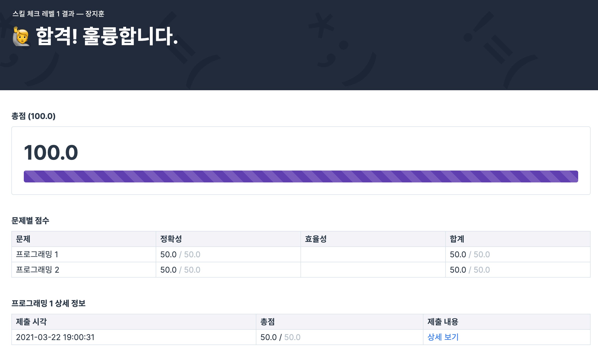

# HOMEWORK #1

### 1. Level 1 Complete

### 2. Source Code
- [첫번째 문제풀이](first/solution.py)
- [첫번째 테스트](first/solution_test.py)

- [두번째 문제풀이](second/solution.py)
- [두번째 테스트](second/solution_test.py)

### 3. Source Code 3
너무 쉬운 문제만 푼 것 같아 다른 아이디로 푼 문제 
- [세번째 문제풀이](third/sol03.py)
- [세번째 테스트](third/sol03_test.py)